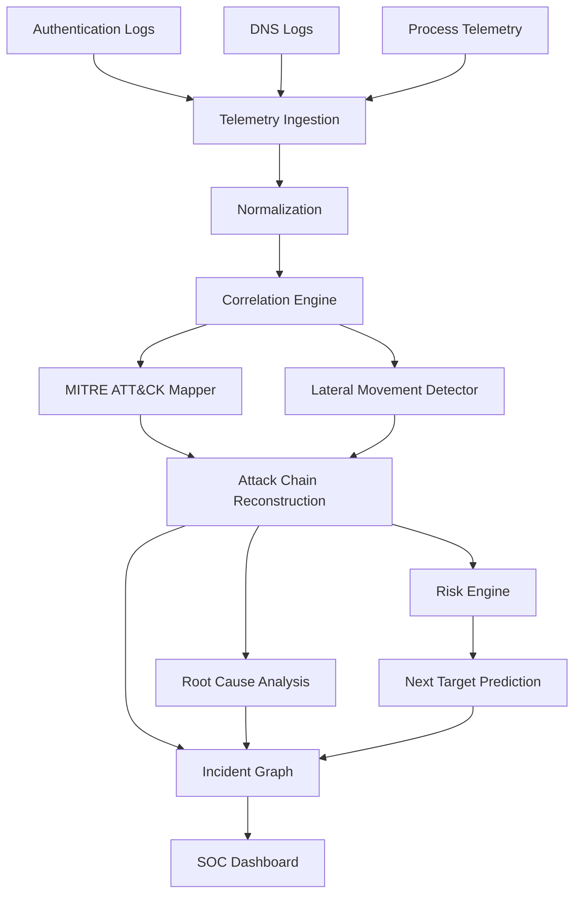

# 🛡️ CyberTrace AI

<p align="center">
  
  
  
  
</p>

<p align="center">
  
  
  
</p>

<p align="center">
  <b>Multi-Stage Cyberattack Reconstruction & Lateral Movement Prediction Platform</b>
</p>

<p align="center">
  <strong>From fragmented security telemetry to one complete attack story.</strong>
</p>

---

## ⚡ What is CyberTrace AI?

Cyberattacks rarely appear as a single obvious event.

Modern security environments generate fragmented telemetry from authentication systems, DNS activity, endpoint processes, network connections, and host relationships.

Individually, these events may look unrelated.

CyberTrace AI is designed to connect those fragments and transform them into a **correlated, explainable incident story**.

```text
🔐 Authentication Logs
          │
          ▼
🌐 DNS Telemetry
          │
          ▼
⚙️ Process Telemetry
          │
          ▼
      Normalization
          │
          ▼
    🔗 Correlation
          │
          ▼
🎯 MITRE ATT&CK Mapping
          │
          ▼
🧩 Attack Reconstruction
          │
          ▼
🕵️ Root-Cause Analysis
          │
          ▼
🚨 Lateral Movement Detection
          │
          ▼
🎯 Next-Target Prediction
          │
          ▼
🕸️ Incident Graph
```

> **One alert can be noise. Connected evidence can reveal the attack.**

---

# 🎯 BYTEATHON 2026 Problem

### Reconstructing Multi-Stage Cyberattacks and Anticipating Lateral Movement by Correlating Fragmented Security Telemetry Across Networked Systems

CyberTrace AI is being developed as a defensive cybersecurity and digital-forensics solution for this challenge.

The platform focuses on connecting fragmented telemetry across systems to help analysts understand:

* Where an attack may have started
* How activity progressed
* Which systems were affected
* How lateral movement occurred
* Which MITRE ATT&CK techniques are represented
* What assets may be at risk next

---

# 🧠 Project Overview

CyberTrace AI follows a security-analysis pipeline:

```text
┌───────────────────────┐
│   Raw Security Data   │
└───────────┬───────────┘
            │
            ▼
┌───────────────────────┐
│    Normalization      │
└───────────┬───────────┘
            │
            ▼
┌───────────────────────┐
│   Event Correlation    │
└───────────┬───────────┘
            │
            ▼
┌───────────────────────┐
│ MITRE ATT&CK Mapping  │
└───────────┬───────────┘
            │
            ▼
┌───────────────────────┐
│ Attack Reconstruction │
└───────────┬───────────┘
            │
            ▼
┌───────────────────────┐
│ Root-Cause Analysis   │
└───────────┬───────────┘
            │
            ▼
┌───────────────────────┐
│ Lateral Movement      │
│ Detection             │
└───────────┬───────────┘
            │
            ▼
┌───────────────────────┐
│ Next-Target Prediction│
└───────────┬───────────┘
            │
            ▼
┌───────────────────────┐
│    Incident Graph     │
└───────────────────────┘
```

---

# 🔍 Telemetry Sources

CyberTrace AI is designed to correlate multiple types of security telemetry.

### 🔐 Authentication

```text
WORKSTATION-01
      │
      ▼
     DEV-01
```

### 🌐 DNS

```text
WORKSTATION-01
      │
      ▼
suspicious-domain.example
```

### ⚙️ Process Telemetry

```text
winword.exe
      │
      ▼
powershell.exe
```

When viewed separately, these events may not provide enough context.

CyberTrace AI connects the evidence to create a broader incident view.

---

# 🧩 Core Features

## 🔍 Multi-Source Telemetry

Supports security telemetry such as:

* Authentication events
* DNS events
* Process events
* CSV/JSON telemetry

---

## 🔗 Event Correlation

Events can be correlated using:

* Timestamps
* Hosts
* Users
* Source/destination relationships
* Process relationships
* Behavioral evidence

---

## 🎯 MITRE ATT&CK Mapping

Observed behaviors can be mapped to relevant **MITRE ATT&CK tactics and techniques**.

```text
Security Event
      │
      ▼
Behavior Analysis
      │
      ▼
MITRE ATT&CK Technique
      │
      ▼
Attack Stage
```

---

## 🧩 Multi-Stage Attack Reconstruction

CyberTrace AI reconstructs related security events into a chronological attack chain.

```text
Initial Activity
      ↓
Execution
      ↓
Compromise
      ↓
Lateral Movement
      ↓
Additional Host Activity
      ↓
Potential Next Target
```

---

## 🚨 Lateral Movement Detection

Identify suspicious movement between networked systems by analyzing relationships between:

```text
👤 Users
   ↓
💻 Hosts
   ↓
⚙️ Processes
   ↓
🌐 Network Activity
   ↓
🎯 Target Assets
```

---

## 🕵️ Root-Cause Analysis

Identify the strongest observed candidate for the initial entry point based on available telemetry and correlated evidence.

---

## 🧠 Next-Target Prediction

CyberTrace AI can estimate potential next-target assets using **explainable risk scoring** based on observed relationships and security evidence.

> Predictions are intended to be evidence-based and explainable rather than opaque guesses.

---

# 🕸️ Incident Graph

CyberTrace AI transforms fragmented telemetry into a connected incident graph.

```text
                  👤 USER
                    │
                    ▼
              💻 WORKSTATION
                    │
             ┌──────┴──────┐
             ▼             ▼
       ⚙️ PROCESS      🌐 DNS
             │             │
             └──────┬──────┘
                    ▼
              💻 DEV-01
                    │
                    ▼
              💻 SERVER-01
                    │
                    ▼
                🗄️ DB-01
```

The graph provides a visual representation of relationships between:

* Hosts
* Users
* Processes
* Events
* Attack stages

---

# 🏗️ Architecture



---

# 🎬 Attack Investigation Flow

```text
🚨 Suspicious Event
        │
        ▼
🔎 Detection
        │
        ▼
🔗 Event Correlation
        │
        ▼
🎯 MITRE ATT&CK Mapping
        │
        ▼
🧩 Attack Reconstruction
        │
        ▼
🕵️ Root-Cause Analysis
        │
        ▼
🚨 Lateral Movement
        │
        ▼
🧠 Risk Analysis
        │
        ▼
🎯 Next-Target Prediction
        │
        ▼
🕸️ Incident Graph
```

---

# 💻 Technology Stack

| Layer                  | Technology                     |
| ---------------------- | ------------------------------ |
| 🖥️ Frontend           | React + TypeScript             |
| 🎨 UI                  | Tailwind CSS                   |
| 🕸️ Graph              | React Flow                     |
| ⚙️ Backend             | Python + FastAPI               |
| 📋 Validation          | Pydantic                       |
| 🗄️ Database           | SQLAlchemy + SQLite/PostgreSQL |
| 📊 Analytics           | Python                         |
| 🧩 Graph Analysis      | NetworkX                       |
| 🛡️ Security Framework | MITRE ATT&CK                   |
| 🚀 API Server          | Uvicorn                        |

---

# 📊 Data Flow

```text
┌──────────────────┐
│    Telemetry     │
└────────┬─────────┘
         ▼
┌──────────────────┐
│      Parser      │
└────────┬─────────┘
         ▼
┌──────────────────┐
│ Normalized Events│
└────────┬─────────┘
         ▼
┌──────────────────┐
│    Correlation   │
└────────┬─────────┘
         ▼
┌──────────────────┐
│ Security Analysis│
└────────┬─────────┘
         ▼
┌──────────────────┐
│  MITRE ATT&CK    │
└────────┬─────────┘
         ▼
┌──────────────────┐
│Incident           │
│Reconstruction    │
└────────┬─────────┘
         ▼
┌──────────────────┐
│ Risk & Prediction│
└────────┬─────────┘
         ▼
┌──────────────────┐
│ SOC Visualization│
└──────────────────┘
```

### Pipeline Stages

**Telemetry** → Collect security events.

**Parser** → Convert incoming data into structured events.

**Normalization** → Standardize telemetry fields.

**Correlation** → Connect events through shared evidence.

**Security Analysis** → Identify suspicious behavior.

**MITRE ATT&CK** → Map observed behavior to attack techniques.

**Incident Reconstruction** → Build the chronological attack story.

**Risk & Prediction** → Analyze potential movement and target exposure.

**SOC Visualization** → Present the investigation through dashboards and graphs.

---

# 🧪 Demo Scenario

CyberTrace AI can use deterministic synthetic telemetry for safe demonstration and testing.

```text
🌐 EXTERNAL SOURCE
        │
        ▼
💻 WORKSTATION-01
        │
        ▼
💻 DEV-01
        │
        ▼
🖥️ SERVER-01
        │
        ▼
🗄️ DB-01
```

The demonstration can show how fragmented telemetry is correlated across these assets.

> ⚠️ The demonstration uses synthetic security data and does not perform real attacks.

---

# 🔌 API

The API documentation below should reflect only endpoints implemented in the current backend.

Example API surface:

```text
GET  /api/health

POST /api/telemetry/upload

POST /api/analysis/run

GET  /api/telemetry

GET  /api/hosts

GET  /api/incidents
```

If implemented:

```text
GET /api/incidents/{id}/graph

GET /api/incidents/{id}/timeline

GET /api/incidents/{id}/predictions

GET /api/mitre/techniques
```

Swagger documentation:

```text
http://localhost:8001/docs
```

---

# 🛠️ Installation

## 1️⃣ Clone the Repository

```bash
git clone https://github.com/Raj-max-pixal/CyberTrace-AI.git
cd CyberTrace-AI
```

## 2️⃣ Backend

Create and activate your Python environment, then install the project's backend dependencies.

```bash
pip install -r requirements.txt
```

## 3️⃣ Frontend

```bash
npm install
```

## 4️⃣ Start Development

```bash
npm run dev
```

> Use the repository's current configuration files to determine the exact backend and frontend startup commands.

---

# 📁 Repository Structure

```text
CyberTrace-AI/
│
├── backend/
│   ├── app/
│   └── ...
│
├── frontend/
│   ├── src/
│   └── ...
│
├── data/
│
├── docs/
│
├── tests/
│
├── README.md
│
└── ...
```

> The structure above represents the intended organization; the actual repository structure should remain the source of truth.

---

# 🔐 Security & Ethics

CyberTrace AI is a **defensive cybersecurity analytics project**.

The project focuses on:

* ✅ Security monitoring
* ✅ Threat analysis
* ✅ Incident reconstruction
* ✅ Digital forensics
* ✅ Lateral-movement analysis
* ✅ Defensive incident response

The demonstration is designed around synthetic telemetry.

CyberTrace AI does **not**:

* ❌ Perform unauthorized attacks
* ❌ Deploy malware
* ❌ Collect real credentials
* ❌ Conduct unauthorized scanning
* ❌ Target real systems

---

# ⚠️ Current Implementation

CyberTrace AI separates implemented functionality from future development.

### ✅ Current / Implemented

* Telemetry ingestion
* Event normalization
* Security-event processing
* Backend API foundation
* Database models
* Synthetic demonstration data
* Cybersecurity analysis foundation

### 🚧 Planned / Roadmap

* Advanced event correlation
* Expanded MITRE ATT&CK mapping
* Advanced attack reconstruction
* Interactive incident graphs
* Real-time telemetry
* Enterprise SIEM integrations
* Advanced graph analytics
* ML-based prediction
* Automated incident reporting

> Features should only be marked as completed when they exist in the current repository implementation.

---

# 🔮 Roadmap

### Phase 1 — Foundation

* [x] FastAPI backend
* [x] Normalized telemetry
* [x] Database models
* [x] Telemetry ingestion
* [x] Deterministic demo data

### Phase 2 — Intelligence

* [ ] Advanced event correlation
* [ ] MITRE ATT&CK mapping
* [ ] Attack reconstruction
* [ ] Lateral movement detection
* [ ] Root-cause analysis
* [ ] Next-target prediction

### Phase 3 — Visualization

* [ ] React Flow incident graph
* [ ] Interactive timeline
* [ ] Host investigation
* [ ] Attack-path visualization

### Phase 4 — Advanced SOC

* [ ] Real-time telemetry
* [ ] SIEM integrations
* [ ] Threat intelligence enrichment
* [ ] Advanced graph analytics
* [ ] ML-based prediction
* [ ] Automated incident reports

---

# 🏆 BYTEATHON Demo Flow

```text
01  📥 Load Synthetic Telemetry
          ↓
02  🔎 Run Security Analysis
          ↓
03  🚨 Detect Suspicious Activity
          ↓
04  🔗 Correlate Events Across Hosts
          ↓
05  🧩 Reconstruct Attack Chain
          ↓
06  🚨 Identify Lateral Movement
          ↓
07  🕵️ Identify Likely Root Cause
          ↓
08  🕸️ Generate Incident Graph
          ↓
09  🎯 Predict Potential Next Target
          ↓
10  🧠 Explain the Prediction
```

---

# ⚡ Why CyberTrace AI?

### Traditional Alert View

```text
🚨 Alert 1

🚨 Alert 2

🚨 Alert 3

🚨 Alert 4
```

### CyberTrace AI

```text
              🎯 Entry Point
                    │
                    ▼
               ⚙️ Execution
                    │
                    ▼
               💻 Compromise
                    │
                    ▼
            🔗 Lateral Movement
                    │
                    ▼
             🎯 Potential Target
```

The key idea:

> **CyberTrace AI is designed to turn fragmented security telemetry into a connected, explainable attack narrative instead of treating every alert as an isolated event.**

---

# 🌟 Key Highlights

```text
        ┌─────────────────────────────┐
        │       CYBERTRACE AI         │
        ├─────────────────────────────┤
        │                             │
        │ 🔍 Telemetry Correlation    │
        │ 🧩 Attack Reconstruction    │
        │ 🎯 MITRE ATT&CK Mapping     │
        │ 🚨 Lateral Movement         │
        │ 🕵️ Root-Cause Analysis     │
        │ 🧠 Risk-Based Prediction    │
        │ 🕸️ Incident Graph           │
        │ 📊 SOC Dashboard             │
        │                             │
        └─────────────────────────────┘
```

---

# 🏆 Built for BYTEATHON 2026

### Theme

**Cybersecurity / Digital Forensics**

### Problem

**Reconstructing Multi-Stage Cyberattacks and Anticipating Lateral Movement by Correlating Fragmented Security Telemetry Across Networked Systems**

CyberTrace AI focuses on connecting fragmented evidence into a structured, explainable incident narrative.

---

# 👥 Team

Built with ❤️ by Raj for cybersecurity innovation.

## 🛡️ CyberTrace AI

> **From fragmented security telemetry to one complete attack story.**

---

## 📜 License

This project is developed for educational, research, and cybersecurity innovation purposes.
